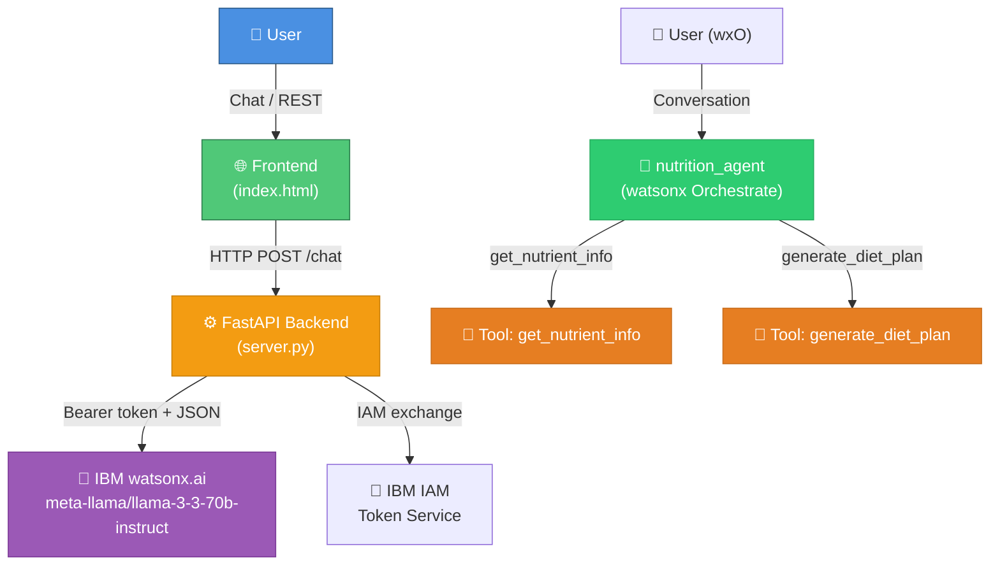

# 🥗 Nutrition Agent

A complete watsonx Orchestrate **Nutrition Agent** powered by `meta-llama/llama-3-3-70b-instruct`
that provides detailed nutrient information for any food item and generates personalised diet plans.

---

## Architecture



---

## Features

| Feature | Description |
|---|---|
| 🥦 **Nutrient Lookup** | Macros + micros for any food (100+ built-in, LLM-expanded) |
| 📋 **Diet Plan Generator** | Personalised 7-day plans with calorie targets & meal ideas |
| 💊 **Vitamin & Mineral Advice** | Functions, deficiencies, best food sources |
| 🍽️ **Meal Suggestions** | Healthy meal ideas for any goal or restriction |
| 📊 **BMI & TDEE Calculator** | Mifflin-St Jeor equation with activity multiplier |
| 🌐 **Web Frontend** | Chat UI + Quick lookup sidebar |
| ⚙️ **FastAPI Backend** | REST API proxying to IBM watsonx.ai |

---

## Project Structure

```
nutrition_agent/
├── __init__.py
├── import-all.sh               ← Import tools & agent into watsonx Orchestrate
├── README.md
├── agents/
│   └── nutrition_agent.yaml    ← watsonx Orchestrate agent config
├── tools/
│   ├── __init__.py
│   └── nutrition_tools.py      ← get_nutrient_info + generate_diet_plan tools
├── backend/
│   ├── server.py               ← FastAPI server (watsonx.ai proxy)
│   ├── requirements.txt
│   └── env.example             ← Copy to .env with your credentials
├── frontend/
│   └── index.html              ← Full chat UI (zero dependencies)
└── generated/                  ← Auto-generated artifacts
```

---

## Quick Start

### 1. Import into watsonx Orchestrate

```bash
# From the nutrition_agent directory
chmod +x import-all.sh
./import-all.sh

# Start the wxO chat
orchestrate chat start
# Select: nutrition_agent
```

### 2. Run the Web UI + Backend

```bash
# Install backend dependencies
cd nutrition_agent/backend
pip install -r requirements.txt

# Copy env template and set credentials
cp env.example .env
# (credentials are already pre-filled in env.example)

# Start FastAPI backend
uvicorn server:app --reload --port 8000

# Open frontend (in another terminal or browser)
# Just open nutrition_agent/frontend/index.html in a browser
```

---

## Configuration

Copy `backend/env.example` to `backend/.env` and fill in your own values:

| Variable | Description | Example |
|---|---|---|
| `WX_API_KEY` | Your IBM Cloud API key | `V6Px...` |
| `WX_PROJECT_ID` | watsonx.ai project ID (sandbox) | `3e8371c7-...` |
| `WX_MODEL_ID` | LLM model ID | `mistralai/mistral-small-3-1-24b-instruct-2503` |
| `WX_URL` | watsonx.ai Chat API endpoint | `https://us-south.ml.cloud.ibm.com/ml/v1/text/chat?version=2023-05-29` |

> ⚠️ **Never commit your `.env` file.** It is listed in `.gitignore`.

---

## Tool Details

### `get_nutrient_info`

| Parameter | Type | Description |
|---|---|---|
| `food_item` | `str` | Food name (e.g. "banana", "grilled salmon") |
| `serving_size_grams` | `float` | Serving size in grams (default 100g) |

**Returns:** Calories, protein, carbs, fat, fibre, sugars, vitamins, minerals, health benefits, cautions.

### `generate_diet_plan`

| Parameter | Type | Description |
|---|---|---|
| `goal` | `str` | `weight_loss`, `muscle_gain`, `maintenance`, `heart_health`, `diabetes_management`, `general_wellness` |
| `age` | `int` | Age in years |
| `gender` | `str` | `male`, `female`, `other` |
| `weight_kg` | `float` | Current weight in kg |
| `height_cm` | `float` | Height in cm |
| `activity_level` | `str` | `sedentary` / `lightly_active` / `moderately_active` / `very_active` / `extra_active` |
| `dietary_restrictions` | `List[str]` | Optional: `vegetarian`, `vegan`, `gluten_free`, etc. |
| `duration_weeks` | `int` | Plan duration (default 4) |

**Returns:** BMI, TDEE-based calorie target, foods to include/avoid, 7-day sample meal plan, hydration advice, supplement tips.

---

## Example Conversations

```
User: What are the nutrients in 150g of salmon?
Agent: Here's the nutritional breakdown for 150g of salmon...
       Calories: 312 kcal | Protein: 30.6g | Fat: 20.1g ...

User: Create a diet plan for muscle gain. I'm 25, male, 75kg, 180cm, very active.
Agent: Great! Here's your personalised muscle-gain plan...
       Daily target: 2,850 kcal | BMI: 23.1 (Normal)...
```

---

## API Endpoints (Backend)

| Method | Endpoint | Description |
|---|---|---|
| `GET` | `/health` | Health check |
| `POST` | `/chat` | Multi-turn conversation with watsonx.ai |
| `GET` | `/nutrients/{food_item}` | Quick nutrient lookup |

---

## Disclaimer

> This agent provides general nutrition information only. For medical conditions,
> eating disorders, or specific health concerns, please consult a registered
> dietitian or healthcare professional.
